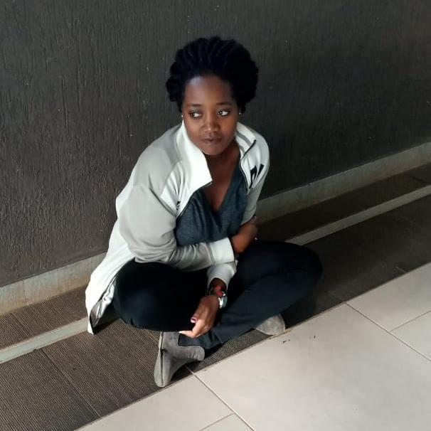

# Hi there 👋

## Hi, I'm Dolla Grace

## About Me
- I'm currently learning Programming at International Youth Fellowship.
- I'm interested in AI, web development, and data science.
- I'm looking to collaborate on beginner-friendly open source projects.

## Skills I'm Building
- Git and GitHub
- Markdown, Python, HTML & CSS, Machine Learning

## Current Projects
- [Finance Tracker — Income Module](https://github.com/dollagraceambwaya-commits/finance-tracker-week-12)

## Currently Learning
- JavaScript (ES6), React 18, Vite
- HTML, CSS
- Git & GitHub

## How to Reach Me
- Email: [dollagraceambwaya@gmail.com](mailto:dollagraceambwaya@gmail.com)
- [LinkedIn](https://www.linkedin.com/in/dolla-grace)
  

<!--
**dollagraceambwaya-commits/dollagraceambwaya-commits** is a ✨ _special_ ✨ repository because its `README.md` (this file) appears on your GitHub profile.

Here are some ideas to get you started:

- 🔭 I’m currently working on ...
- 🌱 I’m currently learning ...
- 👯 I’m looking to collaborate on ...
- 🤔 I’m looking for help with ...
- 💬 Ask me about ...
- 📫 How to reach me: ...
- 😄 Pronouns: ...
- ⚡ Fun fact: ...
-->
